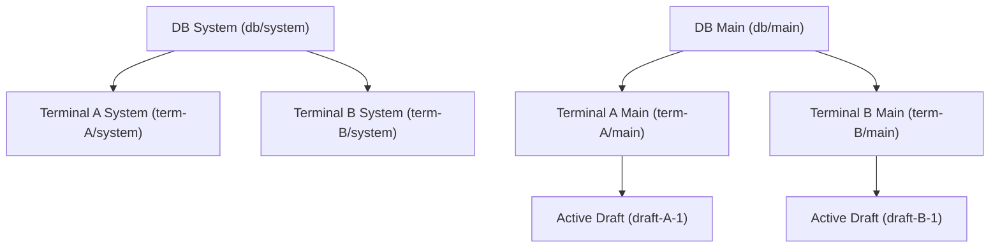

# Design Plan - Multi-Terminal Branch Architecture Strategy

This document outlines the architectural plan for supporting multiple parallel terminals editing the same order repository by separating terminal-level main/system branches from database-level main/system branches.

---

## 1. Context & Objectives

Currently, the POS codebase assumes a single terminal context per repository, using a single local main branch (`BranchType.Main`) and system branch (`BranchType.System`).

In a multi-terminal restaurant environment, multiple terminals (e.g. servers, handheld terminals, cashier desks) will view and edit the same order repository simultaneously. Directly merging all concurrent changes into a single global main branch would result in immediate race conditions, automatic updates that interrupt the current server's screen, and unauthorized payment/checkout events.

### Objectives

- **Terminal Isolation**: Each terminal works in its own isolated branch workspace to avoid mid-checkout state changes caused by other terminals.
- **Global Coordination**: Maintain a single database-level source of truth for confirmed items and global financials.
- **Conflict Handling**: Allow concurrent edits to be merged and reconciled at a central database level.

---

## 2. Proposed Branching Model

We define three tiers of branches within a shared repository:



### A. Database-Level (Global)

- **`db/main`**: The authoritative branch for the order. This is the single source of truth that represents finalized items, payments, and closed checks. No terminal directly commits work to this branch; it is updated only via server-side pulls and merges.
- **`db/system`**: Holds global configurations, shared tax jurisdictions, and global allocations (e.g. order-wide discounts).

### B. Terminal-Level (Local Main/System)

- **`term-[terminalId]/main`**: The local main branch for a specific terminal. When a server commits items or applies payments on Terminal A, they are merged into `term-A/main`.
- **`term-[terminalId]/system`**: Declares allocations specific to the terminal's screen context (e.g., local fulfillment assignments, guest-to-seat mappings).

### C. Active Work-Level (Drafts & Hypotheticals)

- **`draft-[terminalId]-[seq]`**: Short-lived draft branches where servers build items and adjust quantities during a single active screen session.
- **`hyp-[terminalId]-[seq]`**: Incognito scenario branches (What-If modes) for sandboxed edits.

---

## 3. Merge & Sync Lifecycles

### Step 1: Initialize Local Session

When a terminal opens an existing order:

1. Pull the latest commits from `db/main` and `db/system`.
2. Rebase or merge `db/main` into the terminal's local main branch (`term-[terminalId]/main`).
3. Spawn a new draft branch from the updated `term-[terminalId]/main` for local additions.

### Step 2: Committing Local Changes (Send/Pay)

When a server clicks **Send** or **Pay**:

1. Commit the active draft changes.
2. Fast-forward or merge the draft into the local terminal main (`term-[terminalId]/main`).
3. Trigger a database push request.

### Step 3: Server-Side Reconciliation (Database Integration)

When the database receives a push from Terminal A's local main branch:

1. Attempt to merge `term-A/main` into the global `db/main`.
2. **Auto-Reconcile**: If the change is non-conflicting (e.g. Terminal A added Appetizers, Terminal B added Drinks), merge automatically.
3. **Conflict Detection**: If there is a shared state conflict (e.g. both Terminal A and Terminal B modified the quantity of the same item, or applied a payment to the same seat):
   - Reject the automatic merge.
   - Send a conflict payload back to Terminal A, forcing Terminal A to open a **Merge/Reconciliation Dialog** to resolve the conflict before the action completes.

---

## 4. Implementation Guidelines

### Store & Engine Structure

1. **Extend VCS Repository Structure**:
   Update `VCSRepo` to support tracking the database branch hashes:
   ```typescript
   export interface VCSRepo {
     dbMainHead?: string | null;
     dbSystemHead?: string | null;
     // ... existing fields
   }
   ```
2. **Terminal Identity**:
   Introduce a `terminalId` parameter to the ZustStore state to uniquely name local branches (`term-${terminalId}/main`).
3. **Sync API Endpoints**:
   Update the push/pull endpoints `/api/sync/push` and `/api/sync/pull` to accept the `terminalId` parameter, allowing the database to receive commits on terminal-specific branches.
